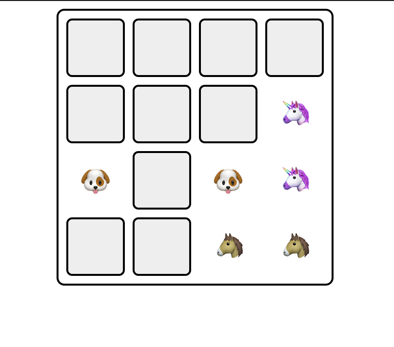

# Memory Card Game

Welcome to the Memory Card Game! This is a simple web-based game where you need to match pairs of cards.

## Instructions

- Display a grid of faced-down cards on the screen, with each card representing a different item or image. You can use emojis as the image, a list of emojis has been provided.
- The grid should consist of an equal number of cards to make pairs.
- When a player clicks on a card, it should flip over and reveal its image.
- Allow the player to select two cards at a time.
- If the two selected cards have the same image, it's a match and they should remain face-up.
- If the two selected cards have different images:
  - Selects other cards, the two selected cards should flip back.
  - Do nothing, the two selected cards should flip back facedown after a short delay.
- When all pairs have been successfully matched, end the game and display a "Play again" button.

## Technologies Used

- REACTJS

## How to Play

1. Clone the repository to your local machine.
2. Open the index.html file in your web browser.
3. Click on the cards to flip them and match pairs.
4. Continue until all pairs are matched.
5. Click the "Play again" button to restart the game.

## Schema

Have fun playing!
